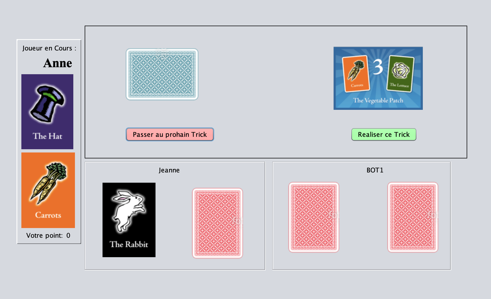

## Application The Other Hatrick Game in java ##

This repository contains working code of a board games named The other hatricks : https://boardgamegeek.com/boardgame/145206/other-hat-trick

The Other Hat Trick is a game of luck, deduction, and pulling rabbits out of hats.

The game contains 17 cards:
• 7 Props: The Rabbit, The Other Rabbit, The Hat, The Lettuce and three identical Carrots.
• 10 Tricks: Each trick card has a name, a points value, and shows the combination of props that are required by a player to successfully perform the trick. 
The trick called The Other Hat Trick also shows penalty points that the players holding the Hat or The Other Rabbit will receive at the end of the game if no-one successfully performs this trick.

